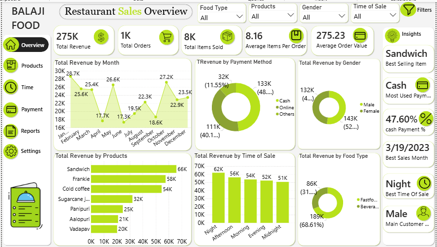

# 🍔 Restaurant Sales Dashboard

## 📌 Project Overview

This Power BI dashboard analyzes restaurant sales performance using interactive visualizations to provide valuable business insights.

The dashboard helps identify sales trends, customer behavior, payment preferences, product performance, and peak business periods.

---

## Dashboard Preview

---

## Key KPIs

- Total Revenue
- Total Orders
- Total Items Sold
- Average Items Per Order
- Average Order Value

---

## Dashboard Features

- Revenue Trend by Month
- Revenue by Product
- Revenue by Payment Method
- Revenue by Food Type
- Revenue by Gender
- Revenue by Time of Sale
- Interactive Filters
- Dynamic Quick Insights

---

## Quick Insights

- 🏆 Best Selling Item: Sandwich
- 💳 Most Used Payment: Cash
- 📅 Best Sales Month: March 2023
- 🌙 Peak Sales Time: Night
- 👤 Main Customer Gender: Male

---

## Tools Used

- Power BI
- Power Query
- DAX
- Data Modeling

---

## Skills Demonstrated

- Data Cleaning
- Data Modeling
- DAX Measures
- Dashboard Design
- Business Intelligence
- Data Visualization

---

## Author

**Ragab Mostafa**

LinkedIn:
https://www.linkedin.com/in/ragab-mostafa-data-analyst

GitHub:
https://github.com/ragabmostafa-data
